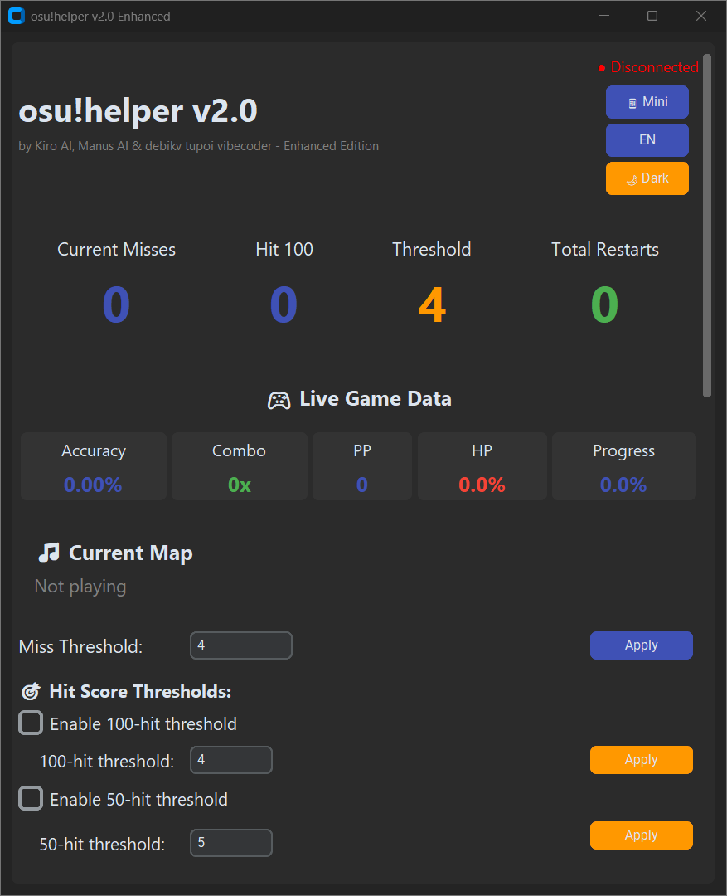
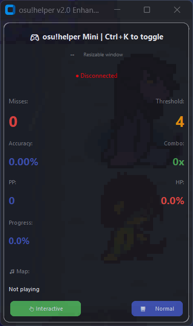
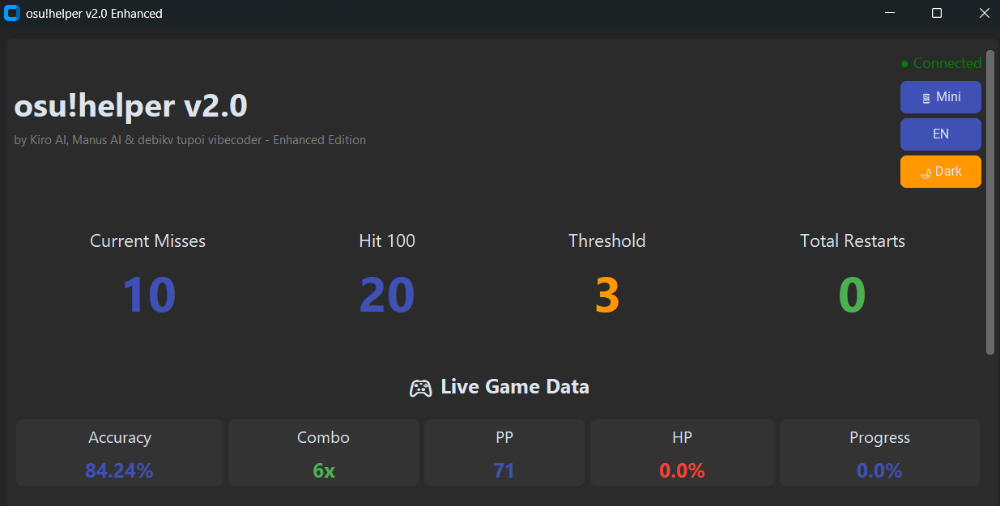

# 🎮 osu!helper v2.0 Enhanced

**EN:** Advanced osu! training assistant with automatic map restart, real-time statistics, and overlay mode.

**RU:** Продвинутый помощник для тренировок в osu! с автоматическим перезапуском карты, статистикой в реальном времени и оверлейным режимом.

---

## 🌟 Features / Возможности

### EN:

**Core Features:**
- ⚡ **Auto-Restart System** - Automatically restarts the map when miss/hit thresholds are reached
- 📊 **Real-Time Statistics** - Track misses, accuracy, combo, PP, HP, and progress
- 🎯 **Hit Thresholds** - Set limits for misses, 100-hit notes, and 50-hit notes
- 📱 **Mini Overlay Mode** - Compact, resizable, transparent overlay with click-through support
- ⌨️ **Global Hotkeys** - Control everything without leaving the game (Ctrl+M, Ctrl+L, Ctrl+K, Ctrl+↑/↓)
- 🎨 **12 Color Schemes** - Customize the interface to your preference
- 📈 **Statistics Module** - View miss graphs, session/all-time averages, export to CSV/JSON
- 🌐 **Bilingual** - Full Russian and English support
- 🔧 **Highly Customizable** - Font sizes, transparency, always-on-top, show/hide elements

**Advanced Features:**
- 🖱️ **Click-Through Mode** - Overlay passes clicks to the game
- ⏱️ **Cooldown System** - Prevent rapid restarts
- 📝 **Activity Log** - Track all events with timestamps
- 💾 **Import/Export Settings** - Save and share your configurations
- 🎮 **TOSU Integration** - Real-time game data via WebSocket

### RU:

**Основные возможности:**
- ⚡ **Система авто-рестарта** - Автоматически перезапускает карту при достижении порогов миссов/хитов
- 📊 **Статистика в реальном времени** - Отслеживание миссов, точности, комбо, PP, HP и прогресса
- 🎯 **Пороги хитов** - Установка лимитов для миссов, 100-очковых и 50-очковых нот
- 📱 **Мини оверлейный режим** - Компактный, изменяемый, прозрачный оверлей с режимом прозрачности для кликов
- ⌨️ **Глобальные горячие клавиши** - Управление без выхода из игры (Ctrl+M, Ctrl+L, Ctrl+K, Ctrl+↑/↓)
- 🎨 **12 цветовых схем** - Настройка интерфейса под свой вкус
- 📈 **Модуль статистики** - Графики миссов, средние значения за сессию/всё время, экспорт в CSV/JSON
- 🌐 **Двуязычность** - Полная поддержка русского и английского языков
- 🔧 **Гибкая настройка** - Размеры шрифтов, прозрачность, поверх всех окон, показ/скрытие элементов

**Продвинутые функции:**
- 🖱️ **Режим прозрачности для кликов** - Оверлей пропускает клики в игру
- ⏱️ **Система задержки** - Предотвращение частых перезапусков
- 📝 **Журнал активности** - Отслеживание всех событий с временными метками
- 💾 **Импорт/Экспорт настроек** - Сохранение и обмен конфигурациями
- 🎮 **Интеграция с TOSU** - Данные игры в реальном времени через WebSocket

---

## 📸 Screenshots / Скриншоты

### Full Mode / Полный режим


### Mini Overlay Mode / Мини оверлейный режим


### Statistics / Статистика


---

## 🚀 Installation / Установка

### EN:

**Requirements:**
- Python 3.8 or higher
- [TOSU](https://github.com/KotRikD/tosu) - osu! overlay data provider
- Windows OS (for hotkeys and click-through features)

**Steps:**

1. **Install TOSU:**
   ```bash
   # Follow instructions at: https://github.com/KotRikD/tosu
   ```

2. **Clone repository:**
   ```bash
   git clone https://github.com/debikv/osu-helper.enhanced.git
   cd osu-helper-enhanced
   ```

3. **Install dependencies:**
   ```bash
   pip install -r requirements.txt
   ```

4. **Run:**
   ```bash
   python osu_helper_v2.0_enhanced.py
   ```

### RU:

**Требования:**
- Python 3.8 или выше
- [TOSU](https://github.com/KotRikD/tosu) - провайдер данных оверлея osu!
- Windows OS (для горячих клавиш и режима прозрачности)

**Шаги:**

1. **Установите TOSU:**
   ```bash
   # Следуйте инструкциям: https://github.com/KotRikD/tosu
   ```

2. **Клонируйте репозиторий:**
   ```bash
   git clone https://github.com/debikv/osu-helper.enhanced.git
   cd osu-helper-enhanced
   ```

3. **Установите зависимости:**
   ```bash
   pip install -r requirements.txt
   ```

4. **Запустите:**
   ```bash
   python osu_helper_v2.0_enhanced.py
   ```

---

## 🎯 Usage / Использование

### EN:

**Basic Setup:**
1. Start TOSU (it should run on `localhost:24050`)
2. Launch osu!helper
3. Click "Start Monitoring"
4. Set your miss threshold (e.g., 5)
5. Play osu! - the map will auto-restart when you reach the threshold

**Hotkeys:**
- `Ctrl+M` - Start/Stop monitoring
- `Ctrl+L` - Clear activity log
- `Ctrl+K` - Toggle mini/full mode
- `Ctrl+↑` - Increase miss threshold
- `Ctrl+↓` - Decrease miss threshold

**Mini Mode:**
1. Press `Ctrl+K` or click "📱 Mini" button
2. Resize window by dragging edges
3. Click "👆 Interactive" to toggle click-through mode
4. In click-through mode, clicks pass through to osu!

**Hit Thresholds:**
1. Enable "100-hit threshold" or "50-hit threshold"
2. Set desired value (e.g., 4 for 100-hits)
3. Map will restart when you get too many 100s or 50s

### RU:

**Базовая настройка:**
1. Запустите TOSU (должен работать на `localhost:24050`)
2. Запустите osu!helper
3. Нажмите "Начать мониторинг"
4. Установите порог миссов (например, 5)
5. Играйте в osu! - карта автоматически перезапустится при достижении порога

**Горячие клавиши:**
- `Ctrl+M` - Старт/Стоп мониторинга
- `Ctrl+L` - Очистить журнал активности
- `Ctrl+K` - Переключить мини/полный режим
- `Ctrl+↑` - Увеличить порог миссов
- `Ctrl+↓` - Уменьшить порог миссов

**Мини режим:**
1. Нажмите `Ctrl+K` или кнопку "📱 Мини"
2. Измените размер окна, потянув за края
3. Нажмите "👆 Interactive" для переключения режима прозрачности
4. В режиме прозрачности клики проходят сквозь окно в osu!

**Пороги хитов:**
1. Включите "Порог 100 очков" или "Порог 50 очков"
2. Установите желаемое значение (например, 4 для 100-хитов)
3. Карта перезапустится при слишком большом количестве 100 или 50

---

## ⚙️ Configuration / Настройка

### EN:

**Customization Options:**
- **Color Schemes:** 12 themes (Default, Ocean, Forest, Sunset, etc.)
- **Font Size:** Adjust interface text size
- **Transparency:** Make window semi-transparent
- **Always on Top:** Keep window above other applications
- **Show/Hide Elements:** Toggle accuracy, combo, PP, HP, progress displays

**Settings Export/Import:**
- Click "💾 Export" to save your configuration
- Click "📂 Import" to load saved settings
- Share configurations with friends!

### RU:

**Опции настройки:**
- **Цветовые схемы:** 12 тем (По умолчанию, Океан, Лес, Закат и др.)
- **Размер шрифта:** Настройка размера текста интерфейса
- **Прозрачность:** Сделать окно полупрозрачным
- **Поверх всех окон:** Держать окно над другими приложениями
- **Показать/Скрыть элементы:** Переключение отображения точности, комбо, PP, HP, прогресса

**Экспорт/Импорт настроек:**
- Нажмите "💾 Экспорт" для сохранения конфигурации
- Нажмите "📂 Импорт" для загрузки сохраненных настроек
- Делитесь конфигурациями с друзьями!

---

## 📊 Statistics / Статистика

### EN:

**Available Data:**
- Miss count graph (last 10 maps)
- Session average misses
- All-time average misses
- Total maps played
- Total restarts

**Export Options:**
- CSV format - for spreadsheet analysis
- JSON format - for programmatic access

### RU:

**Доступные данные:**
- График количества миссов (последние 10 карт)
- Среднее количество миссов за сессию
- Среднее количество миссов за всё время
- Всего сыграно карт
- Всего перезапусков

**Опции экспорта:**
- Формат CSV - для анализа в таблицах
- Формат JSON - для программного доступа

---

## 🛠️ Troubleshooting / Решение проблем

### EN:

**TOSU not connecting:**
- Ensure TOSU is running
- Check it's on port 24050
- Restart both TOSU and osu!helper

**Hotkeys not working:**
- Run as administrator
- Check if another app is using the same hotkeys
- Hotkeys work across all keyboard layouts

**Auto-restart not working:**
- Ensure monitoring is started
- Check your restart key is set correctly
- Verify osu! is in focus when restart triggers

**Black screen in mini mode:**
- Fixed in v2.0 Enhanced
- If persists, try toggling mode twice

### RU:

**TOSU не подключается:**
- Убедитесь что TOSU запущен
- Проверьте что он на порту 24050
- Перезапустите TOSU и osu!helper

**Горячие клавиши не работают:**
- Запустите от имени администратора
- Проверьте не использует ли другое приложение те же клавиши
- Горячие клавиши работают на всех раскладках клавиатуры

**Авто-рестарт не работает:**
- Убедитесь что мониторинг запущен
- Проверьте правильность установки клавиши перезапуска
- Убедитесь что osu! в фокусе при срабатывании перезапуска

**Черный экран в мини режиме:**
- Исправлено в v2.0 Enhanced
- Если проблема сохраняется, попробуйте переключить режим дважды

---

## 🤝 Contributing / Вклад в проект

### EN:

Contributions are welcome! Please feel free to submit a Pull Request.

**Areas for improvement:**
- Additional statistics visualizations
- More color schemes
- Linux/Mac support
- Additional game mode support
- Performance optimizations

### RU:

Вклад приветствуется! Не стесняйтесь отправлять Pull Request.

**Области для улучшения:**
- Дополнительные визуализации статистики
- Больше цветовых схем
- Поддержка Linux/Mac
- Поддержка дополнительных игровых режимов
- Оптимизация производительности

---

## 📝 Credits / Авторы

**Created by / Создано:**
- Kiro AI
- Manus AI
- debikv tupoi vibecoder

**Special Thanks / Особая благодарность:**
- [TOSU](https://github.com/KotRikD/tosu) - For providing real-time osu! data
- CustomTkinter - For the modern UI framework
- osu! community - For inspiration and feedback

---

## 📄 License / Лицензия

This project is licensed under the MIT License - see the LICENSE file for details.

Этот проект лицензирован под MIT License - см. файл LICENSE для деталей.

---

## 🔗 Links / Ссылки

- **TOSU:** https://github.com/KotRikD/tosu
- **osu!:** https://osu.ppy.sh/
- **Issues:** [Report bugs here / Сообщить об ошибках]
- **Discussions:** [Ask questions / Задать вопросы]

---

## 📈 Changelog / История изменений

### v2.0 Enhanced
- ✨ Added hit 50 threshold feature
- 🐛 Fixed TOSU API data structure compatibility
- 🎨 Improved mini mode window restoration
- 🖱️ Enhanced click-through mode with visual indicators
- 📏 Made mini mode window resizable
- 🌐 Improved English translations
- 🔧 Better error handling and logging

### v2.0
- 🎯 Added hit 100 threshold feature
- 📱 Implemented mini overlay mode
- 📊 Added statistics module with graphs
- ⌨️ Global hotkeys system
- 🎨 12 color schemes
- 💾 Import/Export settings
- 🌐 Bilingual support (RU/EN)

---

**⭐ If you find this helpful, please star the repository! / Если вам помогло, поставьте звезду репозиторию!**
